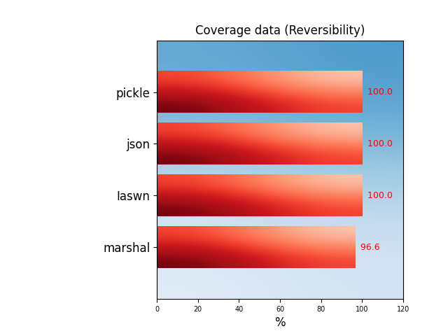

```
(B1b) Full Details: Serializers
┏━━━━━━━━━━━━━━━━━━━━━━━━━━━━━━┳━━━━━━━━━━━━━┳━━━━━━━━━━━━━┳━━━━━━━━━━━━━━━┳━━━━━━━━━━━━━┳━━━━━━━━━━━━━┳━━━━━━━━━━━━━━━━━━┳━━━━━━━━━━━━━━┓
┃ Serializer                   ┃ Encod. Ok ? ┃ Σ Encoded   ┃ Σ Encoded     ┃ Decod. Ok ? ┃ Σ Decoded   ┃ Reversibility ?  ┃ Σ memory     ┃
┃                              ┃ (Max=29)    ┃ Time        ┃ Str. Length   ┃ (Max=29)    ┃ Time        ┃ (Max=29)         ┃              ┃
┃                              ┃             ┃ (seconds)   ┃ (characters)  ┃             ┃ (seconds)   ┃                  ┃              ┃
┡━━━━━━━━━━━━━━━━━━━━━━━━━━━━━━╇━━━━━━━━━━━━━╇━━━━━━━━━━━━━╇━━━━━━━━━━━━━━━╇━━━━━━━━━━━━━╇━━━━━━━━━━━━━╇━━━━━━━━━━━━━━━━━━╇━━━━━━━━━━━━━━┩
│ Iaswn                        │ 29          │ 0.000447    │ 9459          │ 29          │ 0.000470    │ 29 (100.00%)     │ 0 byte       │
│                              │ (100.00%)   │             │               │ (100.00%)   │             │                  │              │
│ json                         │ 29          │ 0.000218    │ 9482          │ 29          │ 0.000198    │ 29 (100.00%)     │ 0 byte       │
│                              │ (100.00%)   │             │               │ (100.00%)   │             │                  │              │
│ marshal                      │ 29          │ 0.000049    │ 9399          │ 29          │ 0.000044    │ 29 (100.00%)     │ 0 byte       │
│                              │ (100.00%)   │             │               │ (100.00%)   │             │                  │              │
│ pickle                       │ 29          │ 0.000093    │ 9637          │ 29          │ 0.000069    │ 29 (100.00%)     │ 0 byte       │
│                              │ (100.00%)   │             │               │ (100.00%)   │             │                  │              │
└──────────────────────────────┴─────────────┴─────────────┴───────────────┴─────────────┴─────────────┴──────────────────┴──────────────┘

(C1a) Conclusion: Data Objects Handled by the Serializer(s)

pickle: According to the tests carried out on all data, pickle can handle 29 data objects among 29 (100.00%), namely bool/false, bool/true, demonstration_dataobj, dict(keys/str), dict(keys/str+subdicts), 
float, int, int_-0xffff, int_-0xffffffff, int_-0xffffffffffffffff, int_-0xffffffffffffffffffffffffffffffff, int_-1, int_0, int_0xffff, int_0xffffffff, int_0xffffffffffffffff, 
int_0xffffffffffffffffffffffffffffffff, int_1, io.string(empty), list, list(+sublists), list(empty), metaclass, none, str, str(empty), str(long), str(non ascii characters) and time(time.time) .

Other serializers:
Iaswn: According to the tests carried out on all data, Iaswn can handle 29 data objects among 29 (100.00%), namely bool/false, bool/true, demonstration_dataobj, dict(keys/str), dict(keys/str+subdicts), 
float, int, int_-0xffff, int_-0xffffffff, int_-0xffffffffffffffff, int_-0xffffffffffffffffffffffffffffffff, int_-1, int_0, int_0xffff, int_0xffffffff, int_0xffffffffffffffff, 
int_0xffffffffffffffffffffffffffffffff, int_1, io.string(empty), list, list(+sublists), list(empty), metaclass, none, str, str(empty), str(long), str(non ascii characters) and time(time.time) .
json: According to the tests carried out on all data, json can handle 29 data objects among 29 (100.00%), namely bool/false, bool/true, demonstration_dataobj, dict(keys/str), dict(keys/str+subdicts), float, 
int, int_-0xffff, int_-0xffffffff, int_-0xffffffffffffffff, int_-0xffffffffffffffffffffffffffffffff, int_-1, int_0, int_0xffff, int_0xffffffff, int_0xffffffffffffffff, int_0xffffffffffffffffffffffffffffffff,
int_1, io.string(empty), list, list(+sublists), list(empty), metaclass, none, str, str(empty), str(long), str(non ascii characters) and time(time.time) .
marshal: According to the tests carried out on all data, marshal can handle 29 data objects among 29 (100.00%), namely bool/false, bool/true, demonstration_dataobj, dict(keys/str), dict(keys/str+subdicts), 
float, int, int_-0xffff, int_-0xffffffff, int_-0xffffffffffffffff, int_-0xffffffffffffffffffffffffffffffff, int_-1, int_0, int_0xffff, int_0xffffffff, int_0xffffffffffffffff, 
int_0xffffffffffffffffffffffffffffffff, int_1, io.string(empty), list, list(+sublists), list(empty), metaclass, none, str, str(empty), str(long), str(non ascii characters) and time(time.time) .

(C1b) Conclusion: Data Objects NOT Handled by the Serializer(s)

pickle: According to the tests carried out on all data, there's no data object among the 29 used data objects that serializer pickle can't handle (0%).

Other serializers:
Iaswn: According to the tests carried out on all data, there's no data object among the 29 used data objects that serializer Iaswn can't handle (0%).
json: According to the tests carried out on all data, there's no data object among the 29 used data objects that serializer json can't handle (0%).
marshal: According to the tests carried out on all data, there's no data object among the 29 used data objects that serializer marshal can't handle (0%).

(C2a) Conclusion: Serializers (Not Sorted)
┏━━━━━━━━━━━━━━━━━━━━━━━━━━━┳━━━━━━━━━━━━━━━━━━┳━━━━━━━━━━━━━━━━━━┳━━━━━━━━━━━━━━━━━━┳━━━━━━━━━━━━━━┓
┃ Serializer                ┃ Σ Encoded Str.   ┃ Σ Encod.+Decod.  ┃ Reversibility    ┃ Memory       ┃
┃                           ┃ Length           ┃ Time (seconds)   ┃ (Coverage Rate)  ┃              ┃
┃                           ┃ (characters)     ┃                  ┃ (Max=29)         ┃              ┃
┡━━━━━━━━━━━━━━━━━━━━━━━━━━━╇━━━━━━━━━━━━━━━━━━╇━━━━━━━━━━━━━━━━━━╇━━━━━━━━━━━━━━━━━━╇━━━━━━━━━━━━━━┩
│ pickle                    │ 9637             │ 0.000162         │ 29 (100.00%)     │ 0 byte       │
│ -                         │ -                │ -                │ -                │              │
│ Iaswn                     │ 9459             │ 0.000917         │ 29 (100.00%)     │ 0 byte       │
│ json                      │ 9482             │ 0.000415         │ 29 (100.00%)     │ 0 byte       │
│ marshal                   │ 9399             │ 0.000093         │ 29 (100.00%)     │ 0 byte       │
└───────────────────────────┴──────────────────┴──────────────────┴──────────────────┴──────────────┘

(C2b) Conclusion: Overall Score Based on 4 Comparisons Points (Σ Encoded Str. Length/Σ Encod.+Decod. Time/Coverage Rate/Σ memory)
┏━━━━━━━━━━━━━━━━━━━━━━━━━━━┳━━━━━━━━━━━━━━━┓
┃ Serializer                ┃ Overall Score ┃
┡━━━━━━━━━━━━━━━━━━━━━━━━━━━╇━━━━━━━━━━━━━━━┩
│ pickle                    │ 6             │
│ -                         │ -             │
│ Iaswn                     │ 12            │
│ json                      │ 10            │
│ marshal                   │ 12            │
└───────────────────────────┴───────────────┘

(C2c) Conclusion
According to the tests carried out on all data, pickle is ranked #4 among 4 serializers (¹). There's no serializer that produces longer strings than pickle and there are 3 serializers, namely marshal, Iaswn 
and json, that produces shorter strings than pickle. There are 2 serializers, namely json and Iaswn, that are slower than pickle and only marshal is faster than pickle. All serializers are equal when it 
comes to data coverage. All serializers are equal when it comes to memory consumption. 

- notes -
[¹] a rank based on 4 comparisons points: Σ jsonstr.len./Σ encod.+decod. time/Coverage Rate/Σ memory

```




