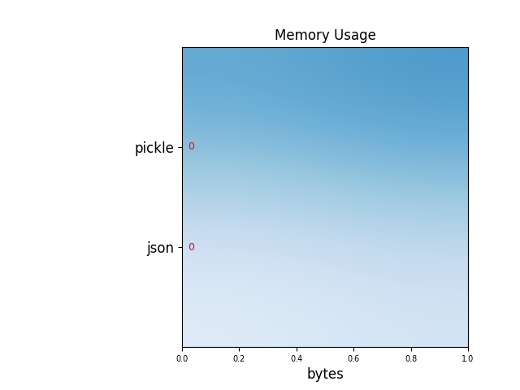
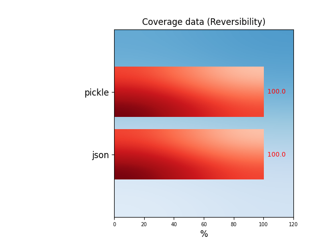

```
(A0) Command Line Arguments

bin/wisteria --cmp="pickle vs json" --report="create_demonstration_report" --filter="data:oktrans_only" --output="reportfile/w=demonstration_reports/2/report.txt" --exportreport="md=demonstration_report.md"

(B1b) Full Details: Serializers
┏━━━━━━━━━━━━━━━━━━━━━━━━━━━━━━┳━━━━━━━━━━━━━┳━━━━━━━━━━━━━┳━━━━━━━━━━━━━━━┳━━━━━━━━━━━━━┳━━━━━━━━━━━━━┳━━━━━━━━━━━━━━━━━━┳━━━━━━━━━━━━━━┓
┃ Serializer                   ┃ Encod. Ok ? ┃ Σ Encoded   ┃ Σ Encoded     ┃ Decod. Ok ? ┃ Σ Decoded   ┃ Reversibility ?  ┃ Σ memory     ┃
┃                              ┃ (Max=29)    ┃ Time        ┃ Str. Length   ┃ (Max=29)    ┃ Time        ┃ (Max=29)         ┃              ┃
┃                              ┃             ┃ (seconds)   ┃ (characters)  ┃             ┃ (seconds)   ┃                  ┃              ┃
┡━━━━━━━━━━━━━━━━━━━━━━━━━━━━━━╇━━━━━━━━━━━━━╇━━━━━━━━━━━━━╇━━━━━━━━━━━━━━━╇━━━━━━━━━━━━━╇━━━━━━━━━━━━━╇━━━━━━━━━━━━━━━━━━╇━━━━━━━━━━━━━━┩
│ json                         │ 29          │ 0.000223    │ 9482          │ 29          │ 0.000211    │ 29 (100.00%)     │ 0 byte       │
│                              │ (100.00%)   │             │               │ (100.00%)   │             │                  │              │
│ pickle                       │ 29          │ 0.000080    │ 9637          │ 29          │ 0.000069    │ 29 (100.00%)     │ 0 byte       │
│                              │ (100.00%)   │             │               │ (100.00%)   │             │                  │              │
└──────────────────────────────┴─────────────┴─────────────┴───────────────┴─────────────┴─────────────┴──────────────────┴──────────────┘

(C1a) Conclusion: Data Objects Handled by the Serializer(s)

pickle: According to the tests carried out on all data, pickle can handle 29 data objects among 29 (100.00%), namely bool/false, bool/true, demonstration_dataobj, dict(keys/str), dict(keys/str+subdicts), 
float, int, int_-0xffff, int_-0xffffffff, int_-0xffffffffffffffff, int_-0xffffffffffffffffffffffffffffffff, int_-1, int_0, int_0xffff, int_0xffffffff, int_0xffffffffffffffff, 
int_0xffffffffffffffffffffffffffffffff, int_1, io.string(empty), list, list(+sublists), list(empty), metaclass, none, str, str(empty), str(long), str(non ascii characters) and time(time.time) .

json: According to the tests carried out on all data, json can handle 29 data objects among 29 (100.00%), namely bool/false, bool/true, demonstration_dataobj, dict(keys/str), dict(keys/str+subdicts), float, 
int, int_-0xffff, int_-0xffffffff, int_-0xffffffffffffffff, int_-0xffffffffffffffffffffffffffffffff, int_-1, int_0, int_0xffff, int_0xffffffff, int_0xffffffffffffffff, int_0xffffffffffffffffffffffffffffffff,
int_1, io.string(empty), list, list(+sublists), list(empty), metaclass, none, str, str(empty), str(long), str(non ascii characters) and time(time.time) .

(C1b) Conclusion: Data Objects NOT Handled by the Serializer(s)

pickle: According to the tests carried out on all data, there's no data object among the 29 used data objects that serializer pickle can't handle (0%).

json: According to the tests carried out on all data, there's no data object among the 29 used data objects that serializer json can't handle (0%).

(C2a) Conclusion: Serializers (Not Sorted)
┏━━━━━━━━━━━━━━━━━━━━━━━━━━━┳━━━━━━━━━━━━━━━━━━┳━━━━━━━━━━━━━━━━━━┳━━━━━━━━━━━━━━━━━━┳━━━━━━━━━━━━━━┓
┃ Serializer                ┃ Σ Encoded Str.   ┃ Σ Encod.+Decod.  ┃ Reversibility    ┃ Memory       ┃
┃                           ┃ Length           ┃ Time (seconds)   ┃ (Coverage Rate)  ┃              ┃
┃                           ┃ (characters)     ┃                  ┃ (Max=29)         ┃              ┃
┡━━━━━━━━━━━━━━━━━━━━━━━━━━━╇━━━━━━━━━━━━━━━━━━╇━━━━━━━━━━━━━━━━━━╇━━━━━━━━━━━━━━━━━━╇━━━━━━━━━━━━━━┩
│ pickle                    │ 9637             │ 0.000149         │ 29 (100.00%)     │ 0 byte       │
│ json                      │ 9482             │ 0.000434         │ 29 (100.00%)     │ 0 byte       │
└───────────────────────────┴──────────────────┴──────────────────┴──────────────────┴──────────────┘

(C2b) Conclusion: Overall Score Based on 4 Comparisons Points (Σ Encoded Str. Length/Σ Encod.+Decod. Time/Coverage Rate/Σ memory)
┏━━━━━━━━━━━━━━━━━━━━━━━━━━━┳━━━━━━━━━━━━━━━┓
┃ Serializer                ┃ Overall Score ┃
┡━━━━━━━━━━━━━━━━━━━━━━━━━━━╇━━━━━━━━━━━━━━━┩
│ pickle                    │ 5             │
│ json                      │ 7             │
└───────────────────────────┴───────────────┘

(C2c) Conclusion
According to the tests carried out on all data, pickle is much faster - by a factor of 2.916 (¹) - than json to encode and decode; strings produced by pickle are slightly shorter - by a factor of 1.016 (²) -
than strings produced by json; pickle and json seem to have exactly the same data coverage; neither pickle nor json seems to consume memory.

- notes -
[¹] factor 2.916 = json's Σ encod.+decod. time / pickle's Σ encod.+decod. time = 0.000 seconds / 0.000 seconds
pickle's Σ encod.+decod. time * 2.916 = 0.000 seconds * 2.916 = json's Σ encod.+decod. time = 0.000 seconds
[²] factor 1.016 = pickle's jsonstring strlen / json's jsonstring strlen = 9637 characters / 9482 characters
json's jsonstring strlen * 1.016 = 9482 characters * 1.016 = pickle's jsonstring strlen = 9637 characters

```







