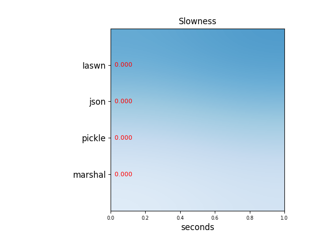
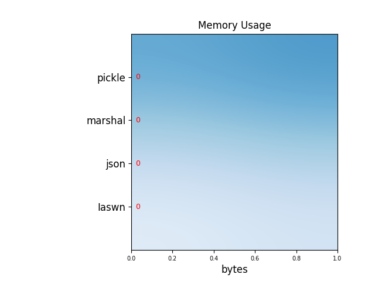
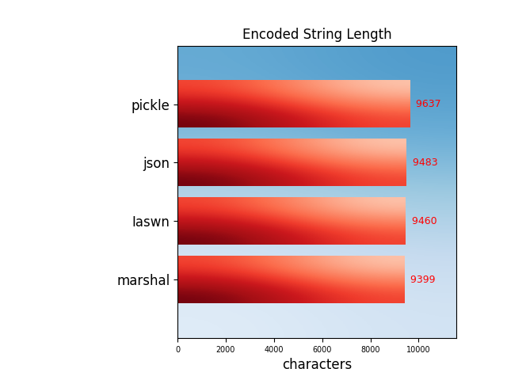
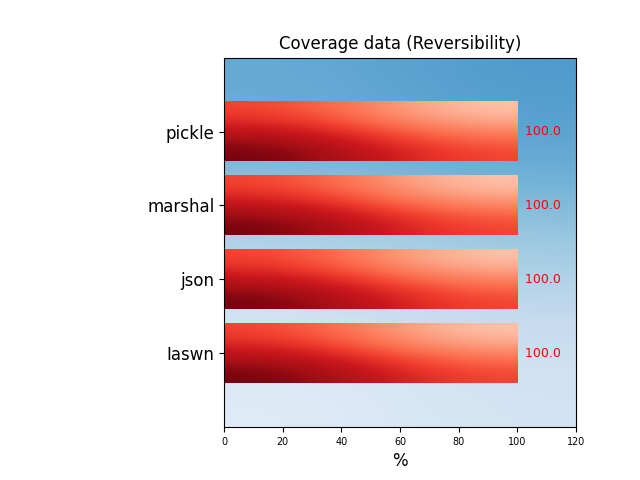

```
Wisteria, 0.1.7 (2021-10-31 19:39:24.750648)
Running on Python 3.9.7 (default, Oct 10 2021, 15:13:22) - [GCC 11.1.0]
The following informations may have been written in the report file ('report.txt') depending of the parameters you passed to the script. --verbosity value has an effect
upon the displayed informations.

* Config file:
  With current arguments, configuration file would be 'wisteria.ini' (/home/proguser/wisteria/wisteria.ini), because of the value of --cfgfile. 
  Such a file exists and can be read without errors.

* 9 Available Serializers:
- Iaswn (0.1.4) [cwc: 'iaswn'], see https://github.com/suizokukan/iaswn .
  > use 'iaswn' in --cmp string.
- json (2.0.9) [cwc: 'default'], see https://docs.python.org/3/library/json.html .
- jsonpickle (2.0.0) [cwc: 'default'], see https://jsonpickle.github.io/ .
- jsonpickle(keys=True) (2.0.0) [cwc: 'default'], see https://jsonpickle.github.io/ .
  > use 'jsonpickle_keystrue' in --cmp string.
  > jsonpickle with keys=True
- marshal (version 4; (Python version) 3.9.7 (default, Oct 10 2021, 15:13:22) - [GCC 11.1.0]) [cwc: 'default'], see 
https://docs.python.org/3/library/marshal.html#module-marshal .
- pickle ((Python version) 3.9.7 (default, Oct 10 2021, 15:13:22) - [GCC 11.1.0]) [cwc: 'default'], see https://docs.python.org/3/library/pickle.html .
- pyyaml (5.4.1) [cwc: 'default'], see https://pyyaml.org/ .
- Amazon Ion Python (0.7.0) [cwc: 'default'], see https://github.com/amzn/ion-python .
  > use 'simpleion' in --cmp string.
  > installation tip: `pip install git+https://github.com/amzn/ion-python`
- yajl (unknown version) [cwc: 'default'], see https://lloyd.github.io/yajl/ .

* 115 Available Data Objects:
array(b); array(b/empty); array(b_unsigned); array(b_unsigned/empty); array(d); array(d/empty); array(f); array(f/empty); array(h); array(h/empty); array(h_unsigned); 
array(h_unsigned/empty); array(i); array(i/empty); array(i_unsigned); array(i_unsigned/empty); array(l); array(l/empty); array(l_unsigned); array(l_unsigned/empty); 
array(q); array(q/empty); array(q_unsigned); array(q_unsigned/empty); array(u); array(u/empty); bool/false; bool/true; bytearray; bytearray(empty); bytes; bytes(empty);
calendar(calendar(3)); collections.chainmap; collections.chainmap(empty); collections.counter; collections.counter(empty); collections.defaultdict; 
collections.defaultdict(empty); collections.deque; collections.deque(empty); collections.ordereddict; collections.ordereddict(empty); complex; 
datetime(datetime.datetime); datetime(datetime.timedelta); dateutil(parser.parse); decimal(+infinity); decimal(-infinity); decimal(0.5); decimal(1/7); decimal(nan); 
dict(keys/bool); dict(keys/float); dict(keys/int); dict(keys/str); dict(keys/str+subdicts); file descriptor; float; float(nan); frozenset; frozenset(empty); function; 
function(python); hashlib(hashlib.sha1); hashlib(hashlib.sha224); hashlib(hashlib.sha256); hashlib(hashlib.sha384); hashlib(hashlib.sha512); imported module; imported 
module(class); imported module(function); int; io.string; io.string(empty); list; list(+sublists); list(empty); memoryview; metaclass; none; notimplemented; 
numbers(complex); numbers(integral); numbers(numbers); numbers(real); pythonexception typeerror; range; range(empty); re.match; re.match(+flags); re.pattern(bytes); 
re.pattern(str); regularclass; regularclass(async_method); regularclass(class_method); regularclass(generator); regularclass(method); regularclass(static_method); 
regularclassinheriteddict; regularclassinheritedlist; set; set(empty); str; str(empty); str(long); str(non ascii characters); time(time.time); tuple; tuple(+subtuples);
tuple(empty); type(str); type(type(str)); wisteria.cwc.pgnreader.default.chessgames; wisteria.cwc.pgnreader.iaswn.chessgames

* Graphs could be created, if required, since matplotlib is installed. They would be called 'report1.png' (/home/proguser/wisteria/report1.png), 'report2.png' 
(/home/proguser/wisteria/report2.png), and so on.

```









